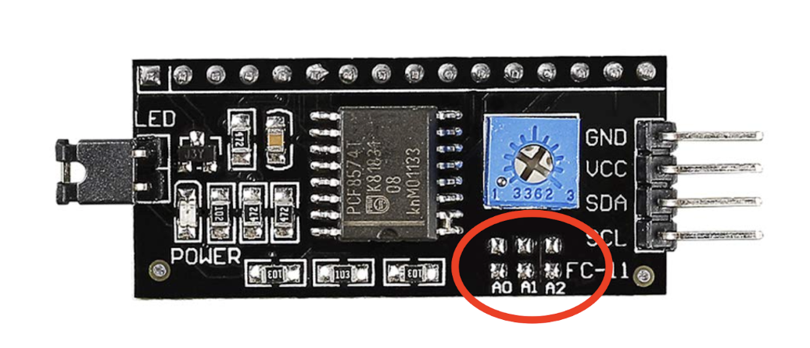
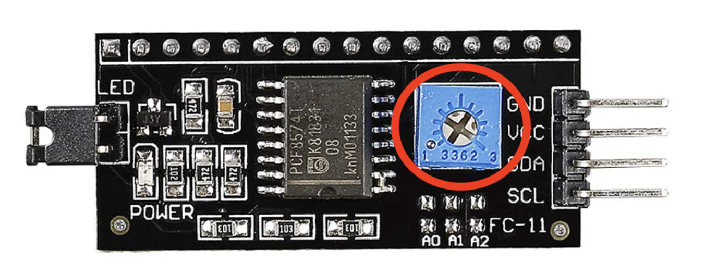

# Habit-Tracker-Box

A hands-on habit tracker that helps you stay consistent with daily or weekly goals. Press a button when a task is done, and the screen shows your progress. You can set flexible goals, like doing something twice a week, and track how often you’ve completed them. Built for real-world routines.

Please note that these instructions are solely intended to guide the assembly of components and software. The physical enclosure or "box" aspect of the project is left to your discretion and design.

## Description

The Habit Tracker Box is a custom-built, physical system designed to help users stay consistent with day-to-day or weekly tasks or habits. It is built using an Arduino Uno, five 16x2 I2C LCD screens, a DS3231 real-time clock (RTC), momentary and maintained push buttons, and necessary wiring. This project combines hardware and software into a reliable goal-tracking solution. 

Each button and LCD screen correspond to a habit such as a gym workout, reading, or meditation. The LCD screen displays the current status of the corresponding task along with the amount of days left or amount of days past depending on the goal. When a habit is completed for the day, the user presses the corresponding button and the LCD screens will display accordingly. 

The tracker is powered by a DS3231 RTC module that allow the system to utilize accurate timekeeping. The DS3231 RTC module has its own battery allowing it to keep track of time even when the system is not plugged in. This enables the user to set goals that must be completed a certain amount of times per week, on any days you choose, or define goals tied to specific custom intervals. For instance, if the goal is to go to the gym twice a week, the system can either reset progress on two chosen days or simply track completion of the goal two times within any seven-day period. 

A kill switch is included to disable screen backlights without interrupting internal time tracking or processes. 

This project merges circuit design, modular C++ programming, and real-world behavior support—making it a strong example of interdisciplinary engineering applied to habit-building and time management. It’s an ongoing work, with planned upgrades including programmable alarms, mobile app sync, and data tracking.

## Components and Tools Used (with Amazon Link)

1x [Arduino Uno](https://www.amazon.com/Gomass-R3-Board-Arduino-Compatible-Arduino/dp/B0F1DBB61D/ref=sr_1_4?crid=SN56N0BARZYF&dib=eyJ2IjoiMSJ9.MazmhFfn-DF8W5oyX_S-tNl6onbpYQvEhqFzrIDbT0beHLH5OCXc5Geq6oSlif89MdqvnchMjlgiB2Tck9Pl2hMMFKma4hJHA58bRavoAP0W8IFCiUT-qewYCO7gC2E3n6mxX25AmDiz-nSoJrM_LzjNaxsWgQfx2JCBDTZClgB5buNIbc9G8Fk7U0Cpn8QBOnyzIYuX8CKVyQIHG3wdrOH1wVT-7dJE2kOlu_KpIr8.1IGJ7vA7LtGAct7LgfEgAl757JIPwpywf0GIbPwaki0&dib_tag=se&keywords=arduino+uno&qid=1754286812&sprefix=arduino+uno%2Caps%2C172&sr=8-4)

5x [16x2 LCD Display with I2C Module](https://www.amazon.com/SunFounder-Serial-Module-Display-Arduino/dp/B019K5X53O/ref=sr_1_2_sspa?crid=2Y2RMU9LB8G7R&dib=eyJ2IjoiMSJ9.QNuwkQ6HaDzkVLSXJkIcxqLRV8eMth2Updpm0mKzIHjPOjeW75n32NpU5L0bYd7TYaYCXNDjKjY4-psYkupNUsHcIdPxtQjfhM6c8vF9fesZpH7-fPsermUc5S468vPDKTRVEAirJcMHZGWwwMLyXbcYK8kJcQCNvWFyBkG1bNWYQiwILoNXA9dV2hc7RltR7pFAwFmgfDSvr186HVHFQA4PSl32pW781nBeJCm3rIo.PExd6uBaAxw9t_p592Sc6hSmChVBjXlmZjCgoo9aCy4&dib_tag=se&keywords=16x2%2Blcd%2Bdisplay%2Bwith%2Bi2c%2Bmodule&qid=1754286957&sprefix=16x2%2Blcd%2Bdisplay%2Bwith%2Bi2c%2Bmodul%2Caps%2C165&sr=8-2-spons&sp_csd=d2lkZ2V0TmFtZT1zcF9hdGY&th=1)

1x [Breadboard](https://www.amazon.com/Breadborad-Solderless-Breadboards-Distribution-Connecting/dp/B082VYXDF1/ref=sr_1_2_sspa?crid=2TGTBYT7JELVZ&dib=eyJ2IjoiMSJ9.qSRroSxKFdd8V4RwgnQiFBLkXey3DJPM3y0plhAbxZbJeJ8Yybi0qqo6QBLV9jZ8_RT8yD4sKBurowMu0d4RociQt_bSy34TFEu7oBI0EcKj6H0-ChmyqN_-qy8lsDpI9RTplQwf51N32KQMn7kKVQcASGLGO73QnTqwcLYGG5GOZIhPRL8Lps2_omjFuRQQN7eVmVkafOupVI_yTw5duoKGzGH3-vEw5-k_YNXvZfc.jiRzZONa7s9wplKEPwP_3PXYLfekR84BxAbG23mDiPg&dib_tag=se&keywords=breadboard&qid=1754287137&sprefix=breadboar%2Caps%2C252&sr=8-2-spons&sp_csd=d2lkZ2V0TmFtZT1zcF9hdGY&psc=1)

1x [DS3231 RTC Module](https://www.amazon.com/AITRIP-Precision-AT24C32-Arduino-Raspberry/dp/B09KPC8JZQ/ref=sr_1_3?crid=3ANPAIZTNTFD7&dib=eyJ2IjoiMSJ9.GGkNjK71nwOlTOet6cFdpB6Oxp4nzGejrVkK3qd2RVQr_euZUfpt6TC8usmiLmrM-g7s_g5pZJxNWTydyFBuhH05NEulft_M24lTDd41t68w0FUJuLbM8afqJudqIXJwezE8YnOM0xPUOHr811TLmISLSZO4h4GoaRqCEKwL-9-lL6ddcD9VUoGZKr65pPgaW33IXsuU0S-q_rWPQPC8YYb_qpKc_Lxk7ZTOna-0nn4.1BQCWR2BCqmtBbyFJOTQZjOW5pGzZl5iXQ2-vuul1h0&dib_tag=se&keywords=DS3231%2Bmodule&qid=1754287173&sprefix=ds3231%2Bmodule%2Caps%2C162&sr=8-3&th=1)

5x [Momentary Push Button](https://www.amazon.com/DaierTek-Momentary-Waterproof-Pushbutton-Automotive/dp/B08R9P3RKM/ref=sr_1_2_sspa?crid=2JX1DMYLHH94T&dib=eyJ2IjoiMSJ9.b1zJXjT6Ynz4fM3G9MacySWikKL-5XOfvMPhhYIWUA0SEArngKYiEu2KZKJ8zc9iTHNsw3hhCYnc2veMNQpzrYiOE5jZNbM1TGGcnYYRoFn5P4IPIW4CrRrLwnHdGon8pmuMIyP0phSnmK59IbnTo62Q-HezN_POYfLLesepNk87Y1TdU8VzBe0aID39dHIQfgDDqFNUkqx24AHcnj_2bVQs7i3RpMdmMtb_5JeNclc.7Oj5Jd5HHnroZxB-o-iKjmcp82t-jp-hkzz18MbOhHg&dib_tag=se&keywords=momentary+push+button&qid=1754287195&sprefix=momentary+push+butto%2Caps%2C174&sr=8-2-spons&sp_csd=d2lkZ2V0TmFtZT1zcF9hdGY&psc=1)

1x [Maintaned Push Button](https://www.amazon.com/Cylewet-Self-Locking-Latching-Button-CYT1091/dp/B075VBV4QH/ref=sr_1_3?crid=1GN249PE6O5YU&dib=eyJ2IjoiMSJ9.QVsrvWcBLTdU_GFGhD-7W5wKya1o_uMKFFXw-0qR4fnUKODZRlL7PhgomJJyGa7e0VyOfNzwkR4_SsbhIrhGJCOFCR28cbz3_NTB46_gnNF3Gxmk-tF0bpjZH3csdwxYJNqEjRqr1jdgjFmfVAG95aWfb71vFIaUERbP7jPGaWCSY7EcDF7voPJ0z1XF9IiujBwCq3RZImX_SfS_hI8RwuGzLtSrGuZdv-AY70HyBWs.vl8sMLs5bQFCaERiUl7UkyiZMqD2P44NnTtqQQw0gFc&dib_tag=se&keywords=maintained+push+button&qid=1754287217&sprefix=maintained+push+button+%2Caps%2C184&sr=8-3) or [Switch](https://www.amazon.com/VEXUNGA-Rocker-Switch-Position-switches/dp/B0CRTKQ96S/ref=sr_1_1_sspa?crid=19DJBEQY2DHFS&dib=eyJ2IjoiMSJ9.e3nYlRLWLtKgUjv2jzucavS1IeM9X4s7Ax915fjhrPTtArDUPEM9Gi9lrGbyWni6CyV7H64Gy2RG-lzXum-U0dSkaDzGgVK-7l7WAr1_k0TUXoEBseRpKdisImgLLRbrDqRgY1UFVm_05WIlMtRv4E56kMVx3n-w0QghtmwDmTgIGR5urp3nxaSuNzYl_S1lGg44UsAXdKbrZ1AbGqULsCZzCQ8-Vd__EnnCc-8AkGU.a-jJ6gJ5SPH29DolMAysG9ceRTdojF-Uh-58nUzMg2U&dib_tag=se&keywords=maintained%2Bswitch&qid=1754287248&sprefix=maintained%2Bswtich%2Caps%2C150&sr=8-1-spons&sp_csd=d2lkZ2V0TmFtZT1zcF9hdGY&th=1)

[22 AWG Wire](https://www.amazon.com/BNTECHGO-Electric-Gauge-Tinned-Copper/dp/B07JNB712X/ref=sr_1_1_sspa?crid=215F0IFH3DWG6&dib=eyJ2IjoiMSJ9.S8nTk5t744tG8O4MOcCmQevPcvhmc-HFuqzgjns7O5XQ5FxCSMRxyFus54OAvREU48K5GoKEJxNb40AiAFgKQf-eUnv9wE8JXzitXlYuvOLXld0_wFGqKSwP0f4FDMFMfRfZ_2sw2im024tQ6chanFa7fmB75pXUkFVw7RkNwzFXLR-xAQPbdrTf5_5cfSJmzmNMsepgZRyK5VydfoUePNLJ3qdj-mqwgRKted6ipd8vA2-iXdrVwt-MROreEJ_rt1C86XGghg1zG7bLqn90489QWXU0IeksNIo-3XJmUds.pH-MKtoqnMW3h7Y0sKD89TwjemnR6sMRR1lSKRsSFb4&dib_tag=se&keywords=22%2BAWG%2BWire&qid=1754287265&sprefix=22%2Bawg%2Bwir%2Caps%2C172&sr=8-1-spons&sp_csd=d2lkZ2V0TmFtZT1zcF9hdGY&th=1)

[Soldering Iron Set](https://www.amazon.com/gp/aw/d/B082F1WKP9/?_encoding=UTF8&pd_rd_plhdr=t&aaxitk=77103a67c65b1fb0ebf28eb3d6e16cac&hsa_cr_id=6950010790401&qid=1754287454&sr=1-1-9e67e56a-6f64-441f-a281-df67fc737124&ref_=sbx_be_s_sparkle_dlcd_asin_0_bkgd&pd_rd_w=C4Cxu&content-id=amzn1.sym.9f2b2b9e-47e9-4764-a4dc-2be2f6fca36d%3Aamzn1.sym.9f2b2b9e-47e9-4764-a4dc-2be2f6fca36d&pf_rd_p=9f2b2b9e-47e9-4764-a4dc-2be2f6fca36d&pf_rd_r=8VJKG16ZASSQ1Q7S2SXJ&pd_rd_wg=QmUhB&pd_rd_r=5435fda9-72cf-48d7-9877-d8ead577a6a3&th=1)

Thin Flathead Screwdriver

## Assembly Instructions

### Step 1: Download Arduino IDE

To program/debug along the way, you’ll need the Arduino IDE.

Download it from the official Arduino website:  
[https://www.arduino.cc/en/software](https://www.arduino.cc/en/software)

Choose the version that matches your operating system:
- **Windows**: Download the `.exe` installer and follow the setup instructions.
- **macOS**: Download the version for your Mac (Intel or Apple Silicon) and drag the app to your Applications folder.
- **Linux**: Download the `.tar.xz` file, extract it, and run `./install.sh` in the terminal.

Once installed:
- Plug in your Arduino.
- Open the Arduino IDE.
- Select your board under **Tools > Board** (e.g., `Arduino Uno`).
- Select your port under **Tools > Port**.

You're now ready to upload code to your Arduino!

### Step 2: Solder LCD Address Pins

Solder the back pads of the LCD Screen. They should look like the following:

  

There are 6 pads in total, arranged in 3 pairs. Each bottom pad is paired with the one directly above it, and together they form what's known as the Address Selection Pins.

Each pair of pads represents one binary digit (bit) in a 3-bit binary code — kind of like a serial number that helps the Arduino know which LCD it's talking to. If a pair of pads is not soldered (open), it counts as a 1. mIf a pair is soldered (bridged), it counts as a 0.

So, with 3 address bits (A2, A1, A0), you can create up to 8 unique binary combinations (from 000 to 111), allowing you to use up to 8 LCDs on the same I2C bus, as long as they each have a different address.

By default, most I2C LCD modules come with all address pins open, meaning the I2C address is likely 0x27. But if you’re using multiple LCDs, they can’t all have the same address, or the Arduino won’t know which one to write to.

For our project we need 5 unique addresses so we need to solder the following pins for individual LCD screens.

- 0x27 - None
- 0x26 - Solder A0
- 0x25 - Solder A1
- 0x24 - Solder A0 and A1
- 0x23 - Solder A2 

### Step 3: Wire everything together

Here is a schematics pdf for you to download. 

[Schematics](media/HabitTrackerBoxSchematicV1.pdf)

| Arduino Pin | Description |
|-------------|-------------|
| 5V  | Connect to all LCDs' VCC pins in parallel & DS3231 RTC VCC |
| GND | Connect to all LCDs' GND pins in parallel & DS3231 RTC GND |
| A4  | Connect to all LCDs' SDA pins in parallel & DS3231 RTC SDA |
| A5  | Connect to all LCDs' SCL pins in parallel & DS3231 RTC SCL |
| GND | Connect to one side of all buttons in parallel |
| D2  | Connect to side of momentary button (not GND side) assigned to LCD address `0x27` |
| D3  | Connect to side of momentary button (not GND side) assigned to LCD address `0x26` |
| D4  | Connect to side of momentary button (not GND side) assigned to LCD address `0x25` |
| D5  | Connect to side of momentary button (not GND side) assigned to LCD address `0x24` |
| D6  | Connect to side of momentary button (not GND side) assigned to LCD address `0x23` |
| D7  | Connect to side of maintained push button (not GND side) used as a kill switch |

### Step 4: Setup 10 Ohm Potentiometer

On the back of the I2C LCD module, you'll find a small blue square component with a screw on top as shown below.

  

The potentiometer controls the contrast of the LCD characters. In simple terms, it adjusts how "dark" or "visible" the text appears on the screen. If the contrast is too low, the screen may look empty. If it's too high, the characters may be too dark or messy.

#### Steps:
1. Power on the LCD module by uploading any code that displays text on the LCD (Make sure to use something like “Hello World” for visibility)
2. Locate the 10K potentiometer
3. Using a flat-head screwdriver, gently turn the potentiometer:
4. Turn clockwise or counterclockwise slowly until the text becomes clearly visible.
5. If you see black rectangles across the top row, the contrast is too high — turn slightly in the other direction.
6. Once the text appears clean and readable, stop turning — it's now optimized for your lighting and viewing angle.

### Step 5: Connect Arduino to Computer 

Connect your Arduino Uno to your computer with everything wired together. Open the Arduino IDE and be ready to download your software below.

## Downloading Software
Fill out the information on the website below, then click “Generate Code.” Once the code is generated, press “Download Code” — the Arduino IDE should open automatically. Once opened, verify that your board and port are selected under the **Tools** menu, then click the **Upload** button to load the code onto your Arduino.

[Download Website Link](https://roopaksai543.github.io/Habit-Tracker-Box/)

## Usage Instructions

Once the software is uploaded and your hardware is fully assembled, you can build a custom enclosure or frame for your Habit Tracker. Make sure you know which button corresponds to which LCD screen and place them accordingly.

#### How to Use the Habit Tracker Box:
1. **Plug in the device.** Connect it to a power source (USB or battery). The system will boot automatically.
2. **Wait for startup.** Let all LCD screens finish flashing. Once they display content, the system is ready for use.
3. **Mark a task as complete.** Press the corresponding momentary button to mark a goal as completed. You’ll see “Task Complete” on the associated LCD.
4.** Reset a task (if needed).** Long-press the same button to reset the task. You’ll see “Reset” displayed when the long press is registered.
**Note:** On initial startup, the display may not reflect the accurate day. Use this input method to bring it up to date.
5. **Use the kill switch.** Press the maintained button (kill switch) to turn the LCD backlights off. Press it again to turn them back on.

## Developer Notes

[Inspiration](inspiration/README.md)

[Project Evolution and Changelog](projectEvolutionAndChangelog/README.md)

